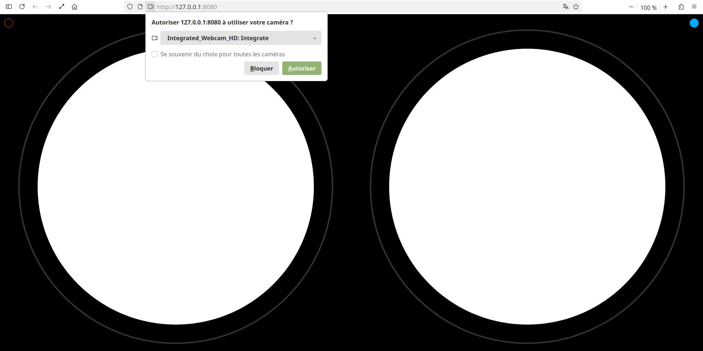
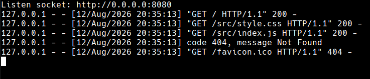

# vr-view
Static webpage with virtual reality view for stereoscopic exploration.  
Browse the internet with Google CardBoard, your phone and your favourite web browser.

  

## Hosted on GitHub Pages
You can try it out here:  
<a href="https://alexandre14k.github.io/vr-view/" target="_blank" rel="noopener noreferrer">https://alexandre14k.github.io/vr-view/</a>

## Local setup
You can try it out with your python3 environment:  

  

## Features
- convex image with javascript postprocessing
- white wire frame -- camera disabled
- black wire frame -- camera enabled
- top left red toggle button 🔴
  - default off -- normal window
  - on -- fullscreen window
 
- top right blue toggle button 🔵
  - default on -- camera enabled
  - off -- camera disabled

## License

SPDX-License-Identifier: AGPL-3.0-or-later 
Copyright (C) 2026 Alexandre Raduly <alexander14k28@gmail.com>
