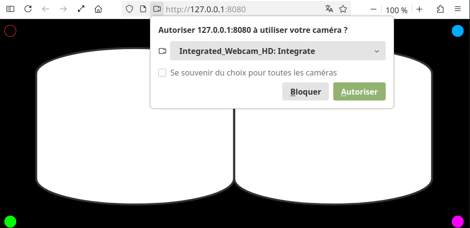
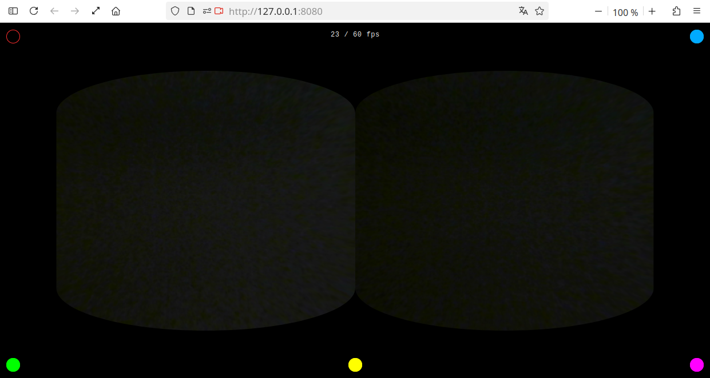
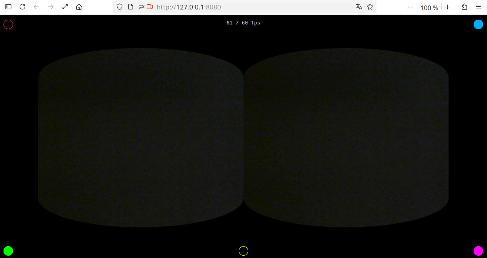

# vr-view
Static webpage with virtual reality view for stereoscopic exploration.  
Browse the internet with Google CardBoard, your phone and your favourite web browser.  
Supported usage with affordable 3D VR Smartphone Headsets (example below) :  <a href="https://www.conrad.fr/fr/p/vr-shinecon-g07e-01-casque-de-realite-virtuelle-noir-gris-3368477.html">https://www.conrad.fr/fr/p/vr-shinecon-g07e-01-casque-de-realite-virtuelle-noir-gris-3368477.html</a>.

## Test default mode

  

## Test fps with distorsion
- webcam selected with covered view
- improvement from 6 / 60 to 23 / 60 fps

  

## Test fps without distorsion
- webcam selected with covered view
- no distorsion means optimal fps

  

## Hosted on GitHub Pages
You can try it out here:  
<a href="https://alexandre14k.github.io/vr-view/" target="_blank" rel="noopener noreferrer">https://alexandre14k.github.io/vr-view/</a>

## Local setup
You can try it out with your python3 environment:  

  

## Features
- convex image with javascript postprocessing
- white wire frame -- camera disabled
- black wire frame -- camera enabled
- top left red toggle button 🔴
  - default off -- normal window
  - on -- fullscreen window
 
- top right blue toggle button 🔵
  - default on -- camera enabled
  - off -- camera disabled

- bottom left green button 🟢
  - shifts lens outward
 
- bottom center yellow toggle button 🟡
  - default on -- distort
  - off -- no distort

- bottom right magenta button 🟣
  - shifts lens inward

## License

SPDX-License-Identifier: AGPL-3.0-or-later 
Copyright (C) 2026 Alexandre Raduly <alexander14k28@gmail.com>
